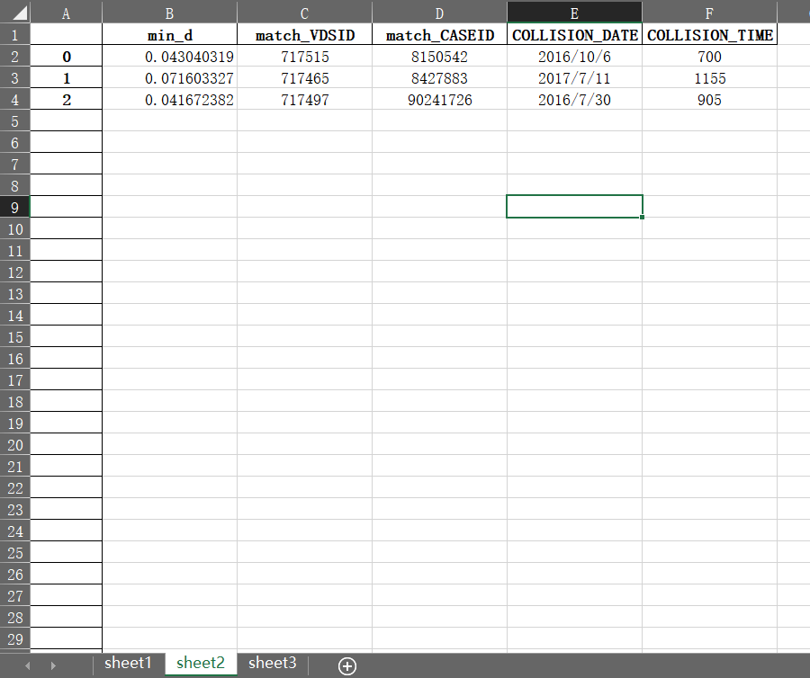

# PeMS Download Helper 

[https://github.com/LumosLovegood/pemsSelenium](https://github.com/LumosLovegood/pemsSelenium)

用于批量下载 PeMS数据集的Selenium自动化下载程序。

### Features:

- 可通过指定excel文件的数据从 PeMS批量下载对应的数据并自动重命名为事故ID。
- 根据excel文件中的sheet表自动创建对应的文件夹，并将每个sheet表的下载文件自动归类到对应的文件夹。
- 开放重新设定时间间隔`interval`和重新读取文件的接口。
- 具有`download_by_Urls`和`download_by_Autofill`两种下载模式可供选择。
  - `download_by_Urls`：通过下载链接直接下载，速度较快。
  - `download_by_Autofill`：通过浏览器模拟输入表单下载，速度较慢。但是看着浏览器自动操作，有一种**很治愈**的感觉。

## Prerequisites

### Tools & package

- 本项目的下载程序为`python`语言，且仅在`python3.7`环境下做过测试。建议在`python3.*`环境下食用。

- 本项目中引用了`selenium`库，因此需要提前安装`selenium`。

  ```powershell
  #使用 conda 安装
  conda install -c conda-forge selenium
  
  #使用 pip 安装
  pip install selenium
  ```

- `selenium`自动化的实现依赖浏览器驱动，因此需要下载`webdriver`浏览器驱动。本项目使用Chrome驱动，[点击打开下载地址](http://npm.taobao.org/mirrors/chromedriver/)。驱动文件最好放在和激活的运行环境的`python.exe`同路径下，使用起来比较方便。

### Data format

程序支持读取excel文件内的数据格式如下图所示，点击查看[示例数据](https://github.com/LumosLovegood/pemsSelenium/blob/main/example_data.xlsx)。<br>




## Getting start


### Import

- 将项目的`pemsDownloadHelper.py`文件下载后放到工作目录，然后在使用时进行导入。

  ```python
  from pemsDownloadHelper import *
  ```

### Usage

- 使用链接下载模式时：

  1. 实例化一个`pemsSelenium`类初始化模拟浏览器；

  2. 实例化一个`pemsUrlData`类用于获取下载链接数据；

  3. 使用`pemsSelenium`里的`download_by_Urls()`函数接收下载链接数据并进行下载。

  ```python
  ps = pemsSelenium(username, password, download_path) 
  pud = pemsUrlData(file_path) 
  ps.download_by_Urls(pud.dataset)
  ```

- 使用模拟输入表单下载模式时：

  1. 实例化一个`pemsSelenium`类初始化模拟浏览器；

  2. 实例化一个`pemsData`类用于获取模拟输入表单需要的数据；

  3. 使用`pemsSelenium`里的`download_by_Autofill()`函数接收数据以及填写表单并下载。

  ```python
  ps = pemsSelenium(username, password, download_path) 
  pd = pemsData(file_path) 
  ps.download_by_Autofill(pd.dataset)
  ```

- ***Notice***: 选择文件下载路径时务必保证路径下为空，最好***新建一个文件夹***进行下载。（涉及文件移动以及重命名操作）


## API description

`pemsDownloadHelper.py`中定义了三个类，其中`pemsData`和`pemsUrlData`用于读取目标数据文件并生成进行下载所需的数据，`pemsSelenium`用于读取上述生成的数据并运行模拟浏览器进行下载。以下介绍了这三个类的可访问属性以及函数。

### pemsData

#### Attributes

|    Name     |           Description           |     Type     |
| :---------: | :-----------------------------: | :----------: |
| `interval`  | 事故的前后时间间隔，默认为3小时 |    *int*     |
| `file_path` |       读取excel文件的路径       |    *str*     |
|  `dataset`  |  生成的模拟输入表单所需的数据   | 嵌套的 *dict* |

#### Functions

|        Name        |                  Description                  | Parameters  |
| :----------------: | :-------------------------------------------: | :---------: |
| `reset_interval()` | 重新设定事故的前后时间间隔并更新`dataset`属性 | `interval`  |
|   `reset_file()`   |        重新读取文件并更新`dataset`属性        | `file_path` |


### pemsUrlData

#### Attributes

|    Name     |           Description           |     Type     |
| :---------: | :-----------------------------: | :----------: |
| `interval`  | 事故的前后时间间隔，默认为3小时 |    *int*     |
| `file_path` |       读取excel文件的路径       |    *str*     |
|  `dataset`  |       生成的下载链接数据        | 嵌套的 *dict* |

#### Functions

|        Name        |                  Description                  | Parameters  |
| :----------------: | :-------------------------------------------: | :---------: |
| `reset_interval()` | 重新设定事故的前后时间间隔并更新`dataset`属性 | `interval`  |
|   `reset_file()`   |        重新读取文件并更新`dataset`属性        | `file_path` |

### pemsSelenium

#### Attributes

|      Name       |                 Description                  |   Type   |
| :-------------: | :------------------------------------------: | :------: |
|      `url`      |              登录pems的官方网址              |  *str*   |
|   `username`    |               登录pems的用户名               |  *str*   |
|   `password`    |                登录pems的密码                |  *str*   |
| `download_path` |                文件的下载路径                |  *str*   |
|    `driver`     | 模拟浏览器驱动，用于执行模拟浏览器的相关操作 | *object* |

#### Functions

|           Name           |          Description           |      Parameters       |
| :----------------------: | :----------------------------: | :-------------------: |
| `download_by_Autofill()` |   通过自动填写表单的方式下载   |  `pemsData.dataset`   |
|   `download_by_Urls()`   | 通过直接访问下载链接的方式下载 | `pemsUrlData.dataset` |

## Planned features

- Windows平台的GUI界面开发
- 泛化文件数据格式支持
- 更多的下载功能

欢迎在这里 [申请新功能以及提出问题](https://github.com/LumosLovegood/pemsSelenium/issues)。

## Contributing

Thanks for [@SeleniumHQ](https://github.com/SeleniumHQ/selenium) for the open-source project.

Special thanks to ***Dazhi_*** for the dataset.


